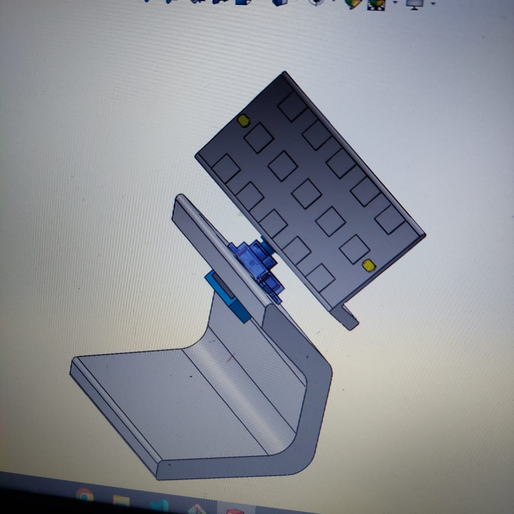
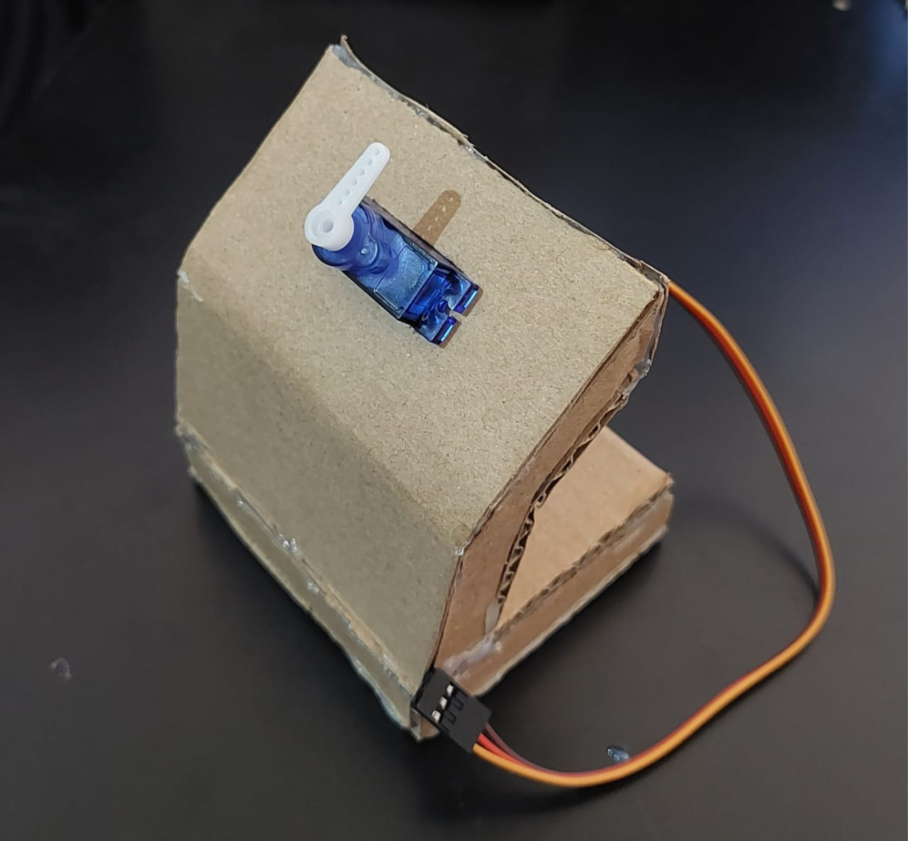
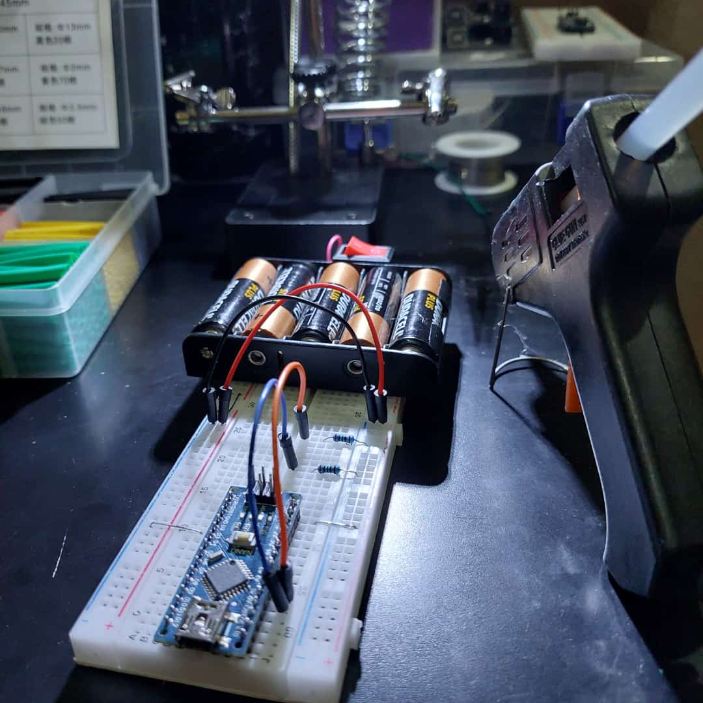

# Arduino :
<h3>Arduino Projects Code.</h3>
<h3>Check out my website for more details <a href='https://ard-uno.netlify.app'>here</a>.</h3> 
 
<h1>Projects list :</h1>
<ol>
    <h3><li>Solar Light Detector <a href='https://ard-uno.netlify.app/projects/solar-panel'> _view_ </a></li></h3>
    <h3><li>..</li></h3>
</ol>
 
<h1>The code for the first project is uploaded.</h1>

    
    
    

